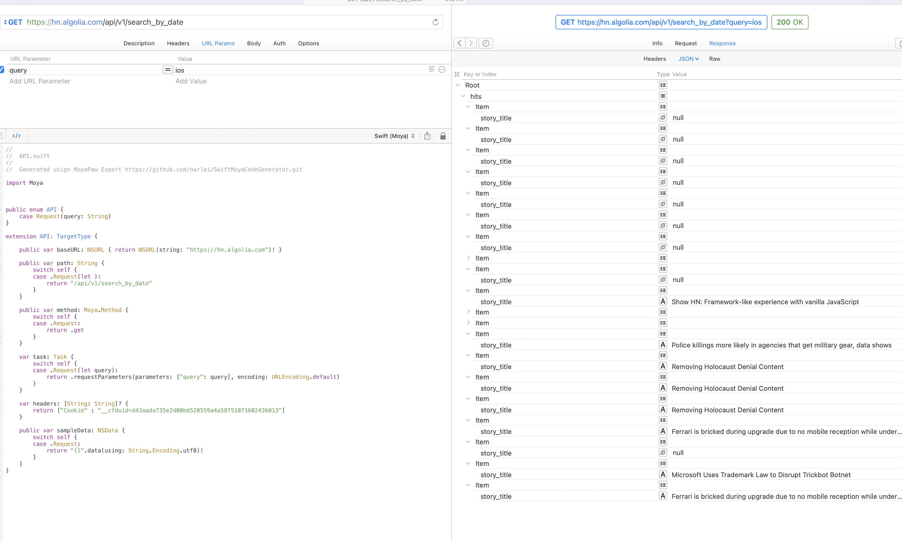

# Posts Feed App

Need to take a look of what's is happening out there with technology. this is your chance to have the most important  recent news about new implementations, CEOs, and tech companies.

## Project distribution

###Common Models:

```
	Post

    /// Created timestamp from post
    private let createdAt: Date
    
    /// Author Name
    private let author: String?
    
    /// Story title
    private let storyTitle: String?
    
    /// Story URL for Post, used for see more details about post
    private let storyURL: String?
    
    /// Post identifier
    let objectID: String?
	
```

About API
-

By testing multiple times API, I found that there are two scenarios where data comes duplicated or nil. I resolved to use objectID as primary key in database (data still comes duplicated anyway), a solution could be to threat story_title as primary key but this is not reccomended. (please find evidence below).




Repository Navigation
-
Each Project contains its own documentation and also description for internal use. So please take a look of each readme, since they behave slightly different.

- iOS: ([Readme](https://github.com/bolivarbryan/PostFeedClients/tree/main/iOS))
- iOS - SwiftUI: ([Readme](https://github.com/bolivarbryan/PostFeedClients/tree/main/iOS-SwiftUI))
